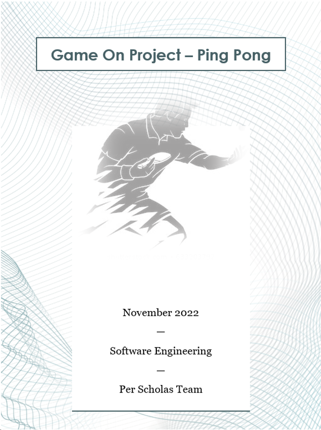
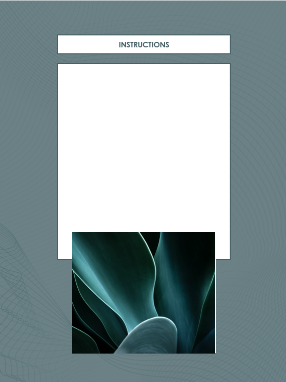
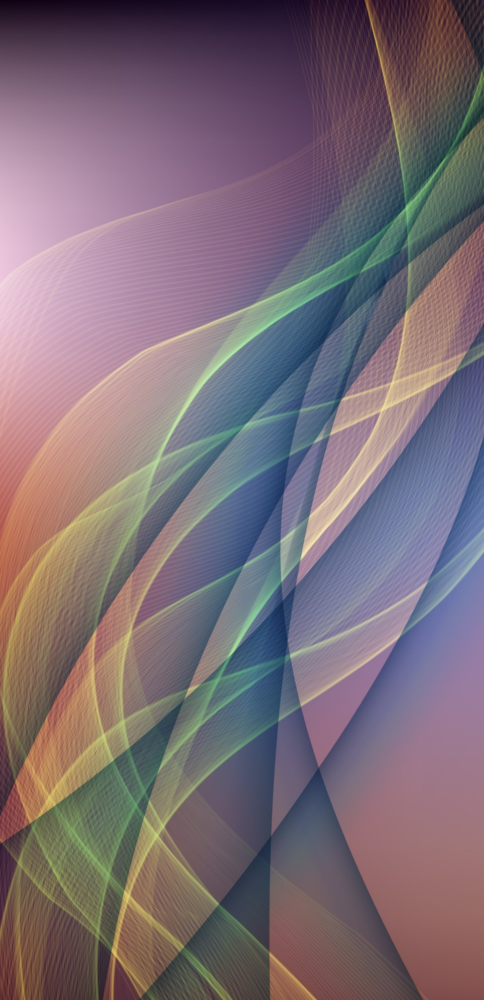

****

**HTML Pages1**

Type chapter title (level 2)2

Type chapter title (level 3)3

**Select Elements4**

Type chapter title (level 2)5

Type chapter title (level 3)6

**Selecting Canvas1**

Type chapter title (level 2)2

Type chapter title (level 3)3

**Draw Shapes4**

Type chapter title (level 2)5

Type chapter title (level 3)6

**Required Objects1**

Type chapter title (level 2)2

Type chapter title (level 3)3

**Style Sheets4**

Type chapter title (level 2)5

Type chapter title (level 3)6

**Multimedia1**

Type chapter title (level 2)2

Type chapter title (level 3)3

**Create Functions 4**

Type chapter title (level 2)5

Type chapter title (level 3)6

**Credits and references 4**

Type chapter title (level 2)5

# Summary

This is a project that I am taking on to start reinitiating my desire to be a software developer.

# 

# 

# HTML Pages

# Select Elements

# Selecting the Canvas

Two lines codes from script.js

# Draw shapes

Ball Image info

Original location of x and Y divided by two since we want it to be at the center.

Just FYI, velocity is nothing but the speed minus direction.

# 

# Required Objects

We need to have these object

User

Computer

Ball

Separator

Score card

# Create Functions

# Credits and References

Studio77 FX vector

# 

Ball Image info

Original location of x and Y divided by two since we want it to be at the center.

Just FYI, velocity is nothing but the speed minus direction.
