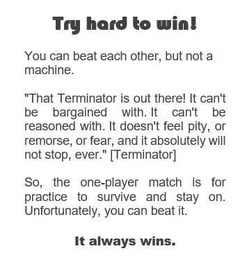
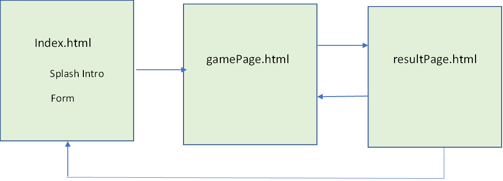
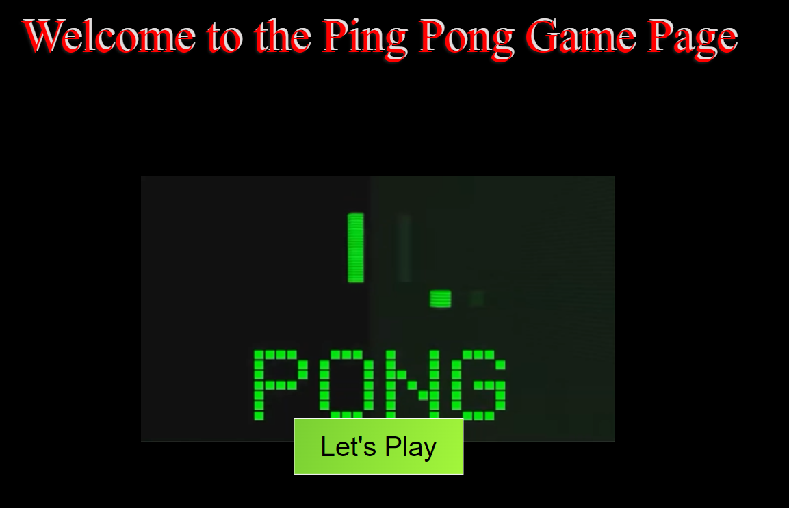
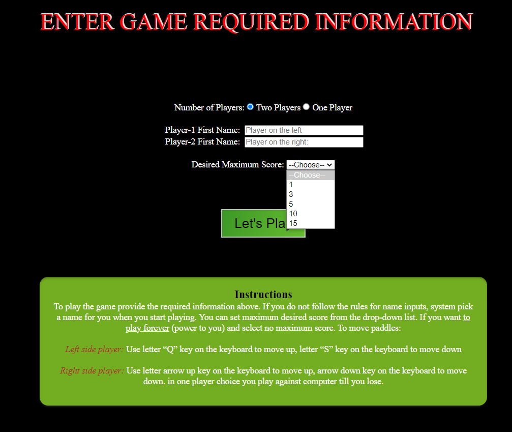
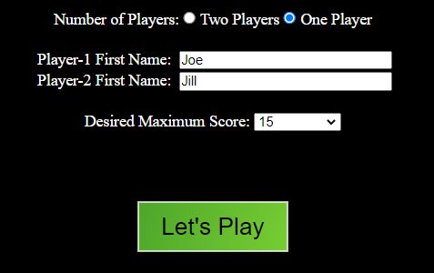
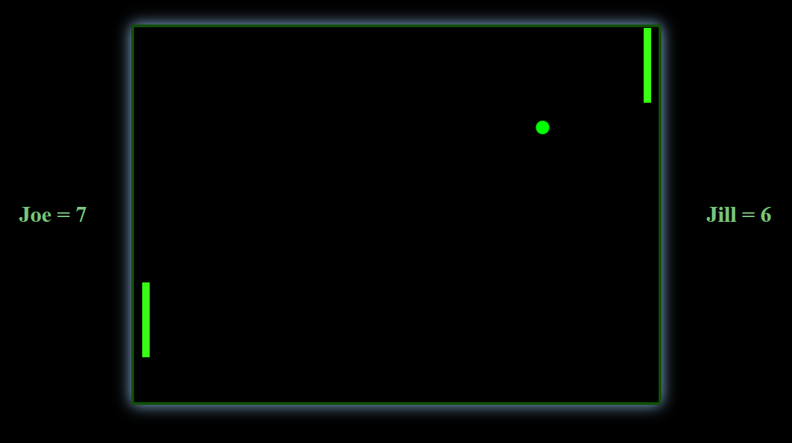
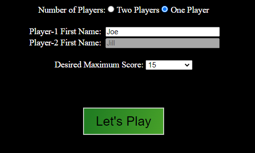
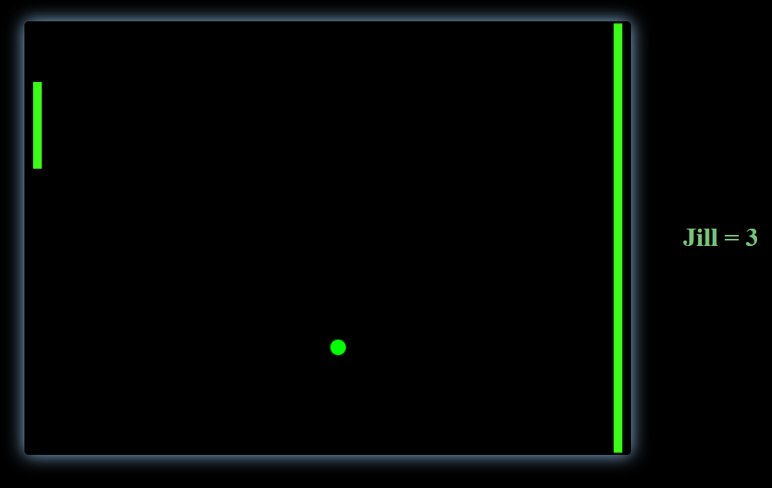
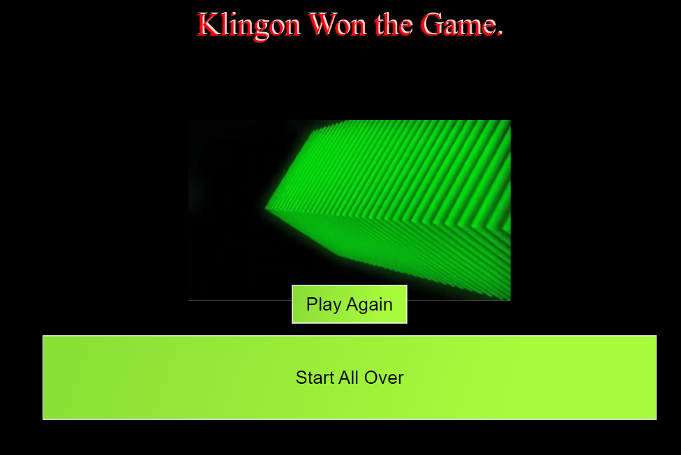
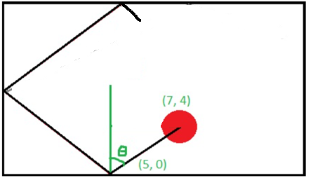

****

**HTML Pages1**

Type chapter title (level 2)2

Type chapter title (level 3)3

**Select Elements4**

Type chapter title (level 2)5

Type chapter title (level 3)6

**Selecting Canvas7**

Type chapter title (level 2)8

Type chapter title (level 3)9

**Draw Shapes10**

Type chapter title (level 2)11

Type chapter title (level 3)12

**Required Objects**13

Type chapter title (level 2)14

Type chapter title (level 3)15

**Style Sheets16**

Type chapter title (level 2)17

Type chapter title (level 3)18

**Multimedia19**

Type chapter title (level 2)20

Type chapter title (level 3)21

**Create Functions 22**

Type chapter title (level 2)23

Type chapter title (level 3)24

**Credits and references 25**

Type chapter title (level 2)26

# Summary

This is a project that I am taking on to start reinitiating my desire to be a software developer.

All the necessary information has been provided within the code. This is kind of work in progress, and I will update everything as we go.

**Instruction of how to play the game**:

To play the game provide the required information. Players need provide the first name only without and blank space, number, and special characters. If players do not follow the rules for name inputs, system pick a name for them when they start playing. They can set maximum desired score from the drop-down list. If they want to play forever, they don’t need to select maximum score.

To move paddles:

**Left side player:** Use letter “Q” key on the keyboard to move up, letter “S” key on the keyboard to move down

**Right side player:** Use letter arrow up key on the keyboard to move up, arrow down key on the keyboard to move down. in one player choice you play against computer till you lose.

# 

# HTML Pages

We are using three HTML pages, while the first page has one virtual page.

-   index.html
-   gamePage.html
-   resultPage.html

By saying virtual, I mean, the intro page comes up, and after user decides to play, on the same page, intro page will be invisible, and form entry page will be visible. Following shows the communication direction among html pages.

Index.html page Intro page:

Index.html page Form:

One player form:

gamePage.html – Two players:

One player form:

gamePage.html - One player:

resultPage.html:

Following are external files are used in the pages:

-   script.js
-   indexStyle.css
-   style.css
-   BookWorm.png
-   Lets_Play_Pong.mp4
-   Play_Again.mp4
-   Pong_Sound.mp4

I have utilized the ‘FAV” icon on each html page tab. To be consistent, each HTML page has the same “title tag. I included a commented part to indicate each HTML page real “title” for further considerations.

**Input Value Sharing**

To communicate value of data in each page with other pages and external file, I have user session storage.

**Window.sessionStorage**

The read-only **sessionStorage** property accesses a session Storage object for the current origin. sessionStorage is similar to **localStorage**; the difference is that while data in localStorage doesn't expire, data in sessionStorage is cleared when the page session ends.

Whenever a document is loaded in a particular tab in the browser, a unique page session gets created and assigned to that particular tab. That page session is valid only for that particular tab.

A page session lasts as long as the tab or the browser is open, and survives over page reloads and restores.

Opening a page in a new tab or window creates a new session with the value of the top-level browsing context, which differs from how session cookies work.

Opening multiple tabs/windows with the same URL creates sessionStorage for each tab/window.

Duplicating a tab copies the tab's sessionStorage into the new tab.

Closing a tab/window ends the session and clears objects in sessionStorage.

Data stored in sessionStorage is specific to the protocol of the page. In particular, data stored by a script on a site accessed with HTTP (e.g., http://example.com) is put in a different sessionStorage object from the same site accessed with HTTPS.

# Select Elements

Need to know:

The **getElementsByClassName** method of Document interface returns an array-like object of all child elements which have all of the given class name(s).

The Document method **getElementById()** returns an Element object representing the element whose id property matches the specified string. Since element IDs are required to be unique if specified, they're a useful way to get access to a specific element quickly.

If you need to get access to an element which doesn't have an ID, you can use **querySelector()** to find the element using any selector.

The **KeyboardEvent.code** property represents a physical key on the keyboard (as opposed to the character generated by pressing the key).

# Selecting the Canvas

// Start to declare canvas and its context \*\*\*\*\*\*\*\*\*\*\*\*\*\*\*\*\*\*\*\*\*\*\*\*\*\*\*\*\*\*\*\*\*\*\*\*\*\*\*\*\*

Following the ‘container’ refers the class name.

const canvas = document.getElementById('container')

const ctx = canvas.getContext("2d")

Need to know:

The **CanvasRenderingContext2D.beginPath()** method of the Canvas 2D API starts a new path by emptying the list of sub-paths. Call this method when you want to create a new path.

The **CanvasRenderingContext2D.closePath()** method of the Canvas 2D API attempts to add a straight line the current point to the start of the current sub-path. If the shape has already been closed or has only one point, this function does nothing.

This method doesn't draw anything to the canvas directly. You can render the path using the **stroke()** or **fill()** methods.

The fill**()** method in HTML canvas is used to fill the current drawing path. The default is black. The \<canvas\> element allows you to draw graphics on a web page using JavaScript. Every canvas has two elements that describes the height and width of the canvas i.e. height and width respectively. Following is the syntax− ctx**.fill();**

But the **ctx.fillStyle** to fill the context element.

# Draw shapes

Ball Image info

Original location of x and Y divided by two since we want it to be at the center.

Just FYI, velocity is nothing but the speed minus direction.

# Required Objects

We need to have these object

User

Computer

Ball

Separator

Score card

# Create Functions

Need to know:

The **setTimeout()** method calls a function after a number of milliseconds.

The **window.requestAnimationFrame()** method tells the browser that you wish to perform an animation and requests that the browser calls a specified function to update an animation before the next repaint. The method takes a callback as an argument to be invoked before the repaint.

**Math behind it:**

The movement and collision with paddles and wall follow simple **y = ax + m** formula. The ball hit the paddles or wall with 45 degrees in various location and bounces back the other direction in 45 degrees. The only time it does not bounce back is when it hit the left and right side. That’s how the opposite player scores.

# Credits and References

Studio77 FX vector

MDN

Eisenfunk

And Many developers from all kind of lives.

# 

# 

# 

# 

# 

